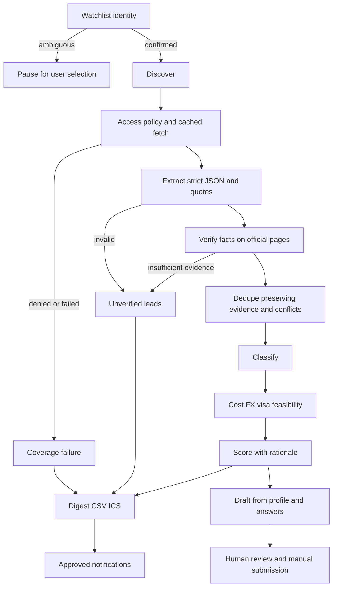

# Pipeline and failure paths

```mermaid
flowchart TD
 W[Watchlist identity] -->|ambiguous| P[Pause for user selection]
 W -->|confirmed| D[Discover]
 D --> A[Access policy and cached fetch]
 A -->|denied or failed| C[Coverage failure]
 A --> E[Extract strict JSON and quotes]
 E -->|invalid| U[Unverified leads]
 E --> V[Verify facts on official pages]
 V -->|insufficient evidence| U
 V --> M[Dedupe preserving evidence and conflicts]
 M --> T[Classify]
 T --> F[Cost FX visa feasibility]
 F --> S[Score with rationale]
 S --> R[Digest CSV ICS]
 S --> G[Draft from profile and answers]
 G --> H[Human review and manual submission]
 R --> N[Approved notifications]
 C --> R
 U --> R
```
